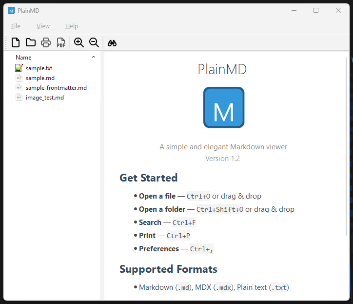
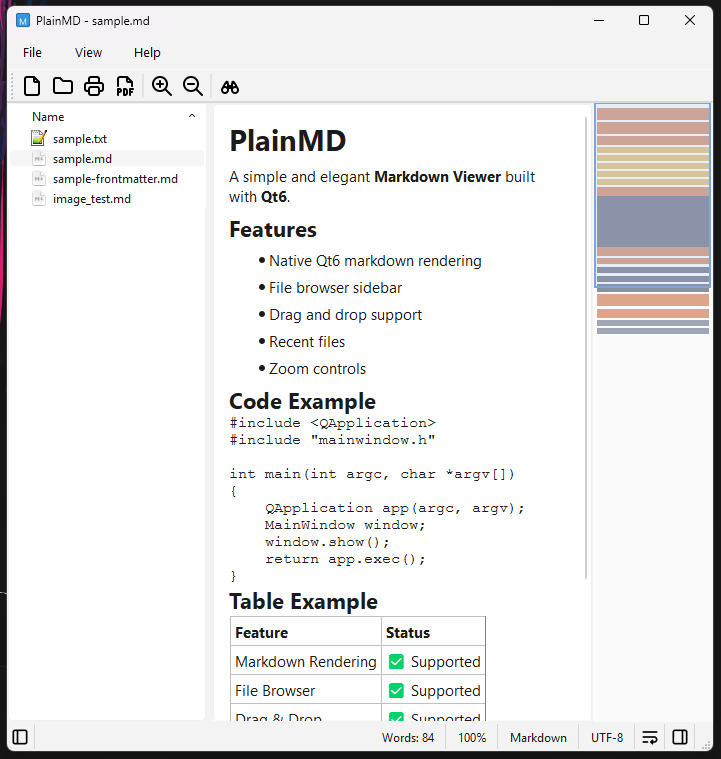

# PlainMD

A simple and elegant **Markdown Viewer** built with **Qt6**.

**PlainMD is partially vibe-coded with OpenCode: Kimi K2.5 Turbo / Kimi K2.6 🤖**


## Features

- **Native Qt6 markdown rendering** - Fast, native rendering without external dependencies
- **File browser sidebar** - Browse and open markdown files with a tree view
- **Multiple format support** - Markdown (.md), MDX (.mdx), and plain text (.txt)
- **Drag and drop support** - Open files and folders by dragging them into the window
- **Recent files & folders** - Quick access to recently opened files and folders with separate history and privacy toggles
- **Auto-reload on file change** - Detects external file modifications and prompts to reload
- **File tree toggle** - Show/hide file browser with F9 or status bar button for distraction-free reading
- **Minimap** - Document overview with color-coded content types (images, headings, lists, links, code blocks) and viewport highlight; toggle with F10 or status bar button. Plain text (.txt) and MDX files show simplified minimap without markdown-specific coloring
- **Status bar** - Shows word count, zoom level, file type, encoding (auto-detected UTF-8 or ANSI), line endings (CRLF/LF), word wrap toggle, and quick-toggle buttons for file tree and minimap
- **Zoom controls** - Zoom in/out with Ctrl++ and Ctrl+-
- **Word wrap toggle** - Toggle line wrapping with Ctrl+W or status bar button
- **Find/Search** - Search within documents with Ctrl+F, find next with F3
- **Search in Files** - Search across all markdown files in the loaded folder with Ctrl+Shift+F. Shows match count per file, snippet preview, and highlights first occurrence when opened
- **Print & Export** - Print to physical printer or export directly to PDF (with better emoji support)
- **Copy Code** - Right-click on code blocks or inline code to copy to clipboard with custom context menu
- **Customizable fonts** - Configure editor font and emoji print font
- **Window title format** - Choose between filename only or full path in window title
- **Privacy options** - Toggle external image loading, recent files/folders history, last opened file, and last opened folder memory independently
- **Folder protection** - Blocks opening root drives and system folders (Windows, Program Files, /usr, etc.) to prevent UI freezing; warns when opening empty folders; shows progress indicator while scanning
- **URL tooltips** - Hover over links to see the resolved absolute path
- **YAML frontmatter display** - Shows frontmatter as a code block

## Screenshots



## System Requirements

### Windows
- Windows 10 or later (64-bit)
- [Visual C++ Redistributable 2022](https://aka.ms/vs/17/release/vc_redist.x64.exe) (most systems already have this installed)

**Note:** If PlainMD fails to start with a missing DLL error, install the Visual C++ Redistributable from the link above. This is a one-time system requirement.

### Linux
- Qt 6.x runtime libraries
- Standard desktop environment (X11 or Wayland)

## Building from Source

### Prerequisites

- Qt 6.x (with Qt6Core, Qt6Gui, Qt6Widgets, Qt6Network, Qt6PrintSupport)
- C++17 compatible compiler

### Windows (Visual Studio 2022)

**Quick build using provided scripts:**
```batch
:: Build
build.bat

:: Clean build artifacts
clean.bat

:: Deploy Qt dependencies (after building)
windeployqt release\plainmd.exe
```

**Manual build:**
```batch
:: Setup MSVC environment (or run vcvarsall.bat x64 directly)
setenv.bat

:: Generate build files and build
qmake plainmd.pro && nmake

:: Deploy Qt dependencies
windeployqt release\plainmd.exe

:: Create installer (optional, requires Inno Setup)
:: Output: dist\plainmd-<version>-x64-setup.exe
build-installer.bat

:: Create portable ZIP (optional)
:: Output: dist\plainmd-<version>-x64-portable.zip
build-zip.bat
```

**Editor integration:** Build tasks are configured for Zed (`.zed/tasks.json`) and VS Code (`.vscode/tasks.json`) for integrated development.

### Linux

**Quick build using provided scripts:**
```bash
# Build release binary
./build.sh

# Clean build artifacts
./clean.sh
```

**Manual build:**
```bash
# Install dependencies (Debian/Ubuntu)
sudo apt install qt6-base-dev build-essential

# Generate build files and build
qmake plainmd.pro && make

# Output: release/plainmd

# Create .deb package (Debian/Ubuntu, optional)
# Output: dist/plainmd_<version>_amd64.deb
./build-deb.sh

# Create AppImage (universal Linux, optional)
# Output: dist/plainmd-<version>-x86_64.AppImage
./build-appimage.sh

# Create Flatpak (optional, requires flatpak-builder)
# Output: dist/plainmd-<version>-<arch>.flatpak
./build-flatpak.sh
```

## Usage

### Opening Files

- **File Menu** → Open File (Ctrl+O) or Open Folder (Ctrl+Shift+O)
- **Drag and drop** files or folders into the window
- **Command line:** `plainmd <file.md>`
- **Double-click** .md files (after file association on Windows)

### Navigation

- **File tree** on the left shows all markdown files in the current folder
- **Recent files** in the File menu for quick access
- Click any file in the tree to view it instantly

### Keyboard Shortcuts

| Shortcut | Action |
|----------|--------|
| Ctrl+O | Open file |
| Ctrl+Shift+O | Open folder |
| Ctrl+F | Find in document |
| F3 | Find next |
| Ctrl+Shift+F | Search in files |
| F9 | Toggle file tree |
| F10 | Toggle minimap |
| Ctrl+W | Toggle word wrap |
| Ctrl+P | Print |
| Ctrl+Shift+P | Export to PDF |
| Ctrl+, | Preferences |
| Ctrl++ | Zoom in |
| Ctrl+- | Zoom out |
| Ctrl+0 | Reset zoom |
| Esc | Clear search highlight |

## Configuration

Access preferences via **View → Preferences** (Ctrl+,):

- **Editor Font** - Main text font
- **Emoji Print Font** - Font for emoji characters when printing (use a Nerd Font for best results)
- **External Editor** - Path to your preferred external editor
- **Window Title** - Choose between filename only or full path format
- **Privacy** - Toggle external image preview, recent files/folders history, last opened file, and last opened folder memory independently

### Emoji Printing on Windows (Experimental)

Color emoji fonts (like Segoe UI Emoji) may not render correctly when printing to PDF. To fix this:

1. Install a Nerd Font (e.g., "CaskaydiaCove Nerd Font", "JetBrainsMono Nerd Font")
2. Open Preferences → Editor
3. Set "Emoji Print Font" to your Nerd Font
4. Check "Use for emoji printing"
5. Now emojis will print correctly as monochrome glyphs

## Architecture

- **Single-window desktop app** - Entry: `src/main.cpp` → `MainWindow`
- **Qt6 native rendering** - Uses `QTextEdit::setMarkdown()` for rendering (no external parser)
- **File system model** - `QFileSystemModel` wrapped with `FilterProxyModel` for file tree
- **Auto-reload** - `QFileSystemWatcher` monitors loaded files for external changes
- **Settings** - `QSettings` (IniFormat) for preferences persistence

## Project Structure

```
PlainMD/
├── src/                    # Source code
│   ├── main.cpp
│   ├── mainwindow.cpp/h    # Main window and UI
│   ├── preferencesdialog.cpp/h/ui # Preferences dialog
│   ├── finddialog.cpp/h/ui         # Find in document dialog
│   ├── searchindialog.cpp/h/ui       # Search in files dialog
│   ├── aboutdialog.cpp/h/ui        # About dialog with license viewer
│   ├── licensedialog.cpp/h/ui      # License viewer dialog
│   ├── minimap.cpp/h       # Document minimap widget
│   └── filterproxymodel.cpp/h      # File tree filtering
├── images/                 # Application icons (Tabler Icons)
├── samples/                # Sample markdown files
├── .zed/                   # Zed Editor configuration
│   └── tasks.json          # Build tasks for Zed
├── .vscode/                # VS Code configuration
│   └── tasks.json          # Build tasks for VS Code
├── plainmd.pro             # qmake project file
├── plainmd.qrc             # Qt resources
├── plainmd.rc              # Windows resources
├── build.bat               # Windows build script
├── clean.bat               # Windows clean script
├── setenv.bat              # Set up MSVC environment
├── build-installer.bat     # Windows installer builder (outputs to dist/)
├── make-checksums.bat      # Generate SHA256 checksums for dist packages (Windows)
├── build.sh                # Linux build script
├── clean.sh                # Linux clean script
├── build-deb.sh            # Debian package builder (outputs to dist/)
├── install-deb.sh          # Debian install helper
├── uninstall-deb.sh        # Debian uninstall helper
├── build-appimage.sh       # AppImage builder (outputs to dist/)
├── make-checksums.sh       # Generate SHA256 checksums for dist packages (Linux)
├── archive-release.sh      # Create versioned zip archive of dist/ folder (Linux)
├── archive-release.bat     # Create versioned zip archive of dist/ folder (Windows)
├── dist/                   # Distribution packages (.exe, .deb, .AppImage, .sha256)
├── installer.iss           # Inno Setup installer script
├── .gitattributes          # Git line ending rules (for WSL/cross-platform dev)
├── README.md               # User documentation
└── AGENTS.md               # Developer documentation
```

## License

GPLv3 License - See [LICENSE](LICENSE) file for details.

## Acknowledgments

- Icons by [Tabler Icons](https://tabler.io/icons) (MIT License)
- Built with [Qt6](https://www.qt.io)

---

**Happy markdown viewing!** 📄✨
